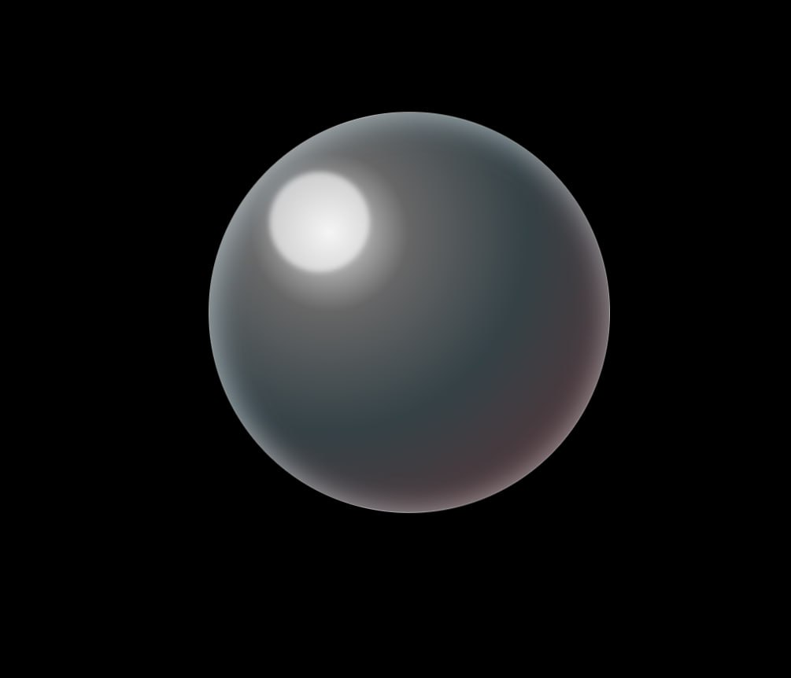

# BUBBLE

  

BUBBLE uses creator fees to grow a pool until it pops and redistributes all accumulated fees to current holders.

---

## How It Works

- Creator fees are collected into a distribution pool.
- The pool grows in real time.
- If price drops 10%, distribution is triggered.
- All current holders receive an equal share.

This mechanism acts like a volatility-triggered redistribution system.

---

## Core Logic

1. Accumulate fees.
2. Monitor price continuously.
3. Trigger distribution at -10% threshold.
4. Reset and begin new growth cycle.

---

## Why

Traditional tokens leak value.
BUBBLE accumulates it and redistributes based on volatility events.

---

## Features

- Fee accumulator
- Price monitoring trigger
- Equal-share distribution model
- Cycle-based reset system

---

## Status

Experimental mechanism.
Not financial advice.
